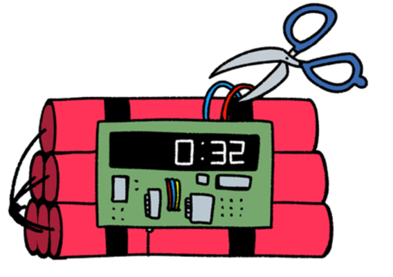

# Object_Boom

- [ゲームについて](#ゲームについて)
  - [ゲーム説明](#ゲーム説明) 
  - [素材](#素材)
  - [素材処理](#素材処理)
- [ストーリー](#ストーリー)

## ゲームについて
### ゲーム説明
本作は時限爆弾解除ゲームです。プレイヤーは制限時間内に正しいパスワードを入力し、爆弾を解除しなければなりません。
 - 爆弾のパスワード針は常に回転しています。
 - 数字のエリア上でスペースキーを押すことで、その数字を入力できます。
 - パスワードが完全に一致すれば爆弾解除成功。
 - 入力を間違えるとカウントダウンが加速し、さらにそれまでの入力をやり直さなければなりません。
 - パスワードは状況によって変化する場合もあります。

### 素材
#### 画像
##### 時限爆弾



#### 音
##### 爆発音_1
[countdown.wav](./Doc/Audio/countdown.wav)
[clock.wav](./Doc/Audio/clock.wav)


### 素材処理
#### 画像編集ソフト
##### 時限爆弾


    - 画像を ``Assets/Images`` フォルダに保存。
    - 画像の名前を ``Boom[815x360].png`` に変更。
    - 画像のサイズを ``815x360`` に変更。

##### 数字


    - 画像を ``Assets/Images`` フォルダに保存。
    - 画像の名前を ``Number[430x74][43x74_10].png`` に変更。
    - 画像のサイズを ``430x74`` に変更。
    - 画像を10等分し、1つの数字のサイズを ``43x74`` に変更。
    
##### 区切符（くぎりふ）


    - 画像を ``Assets/Images`` フォルダに保存。
    - 画像の名前を ``Separator[17x74].png`` に変更。
    - 画像のサイズを ``17x74`` に変更。
    - 爆弾中の座標は ``(x=465, y=165)`` に配置。

## プログラムについて
### 開発環境
 - Visual Studio 2022

### 環境変数

#### 環境変数


他の方法：
 1. **Windowsキー** を押し、「環境変数」と入力 → **「システム環境変数の編集」** をクリック。
 2. 「システムのプロパティ」ウィンドウが開くので、下部の **「環境変数(N)...」** ボタンをクリック。

#### 環境変数 ``KAMATA_ENGINE`` を設定


 
  - **KAMATA_ENGINE** : ``<KamataEngineのパス>``
 - **<KamataEngineのパス>** : ``C:\path\to\KamataEngine`` のように、**KamataEngine** フォルダの絶対パスを指定。

#### テストする
**PowerShell**の方は：
```powershell
echo $env:KAMATA_ENGINE
```
**コマンドプロンプト**の方は：
```cmd
echo %KAMATA_ENGINE%
```
パスが表示されれば成功です。
### コンパイラの「インクルードパス」を設定
``include/`` 配下のヘッダーファイルを直接見つけられるようにする：

 1. プロジェクトを右クリック → ``Properties``（プロパティ）。
 2. 左ペインで ``Configuration Properties → C/C++ → General`` を選択。
 3. Additional Include Directories に次を追加：
```
$(ProjectDir)include;
```

``$(ProjectDir)`` マクロを使うと、絶対パスのハードコードを避けられます。階層が深い場合は ``$(SolutionDir)libs\engine\include`` などに変更してください。
左上の **Configuration** は **「All Configurations」、Platform** は **「All Platforms」** を選択すると、**Debug/Release、Win32/x64** の両方に適用されます。

## ストーリー
```
プレイヤー：貴方……誰だ？
声　　：……こんにちは、参加者。
プレイヤー：参加者って何だよ？
声　　：私のゲームに参加してくれてありがとう。
プレイヤー：何を言ってるんだ……
声　　：落ち着いて。君が見ている爆弾は、君の嫌いなあの人の家にある。
プレイヤー：.......
声　　：考えてみて。何もしなければその人はこの世から消える。
声　　：あるいは、四回のチャンスをあげよう。正しいパスワードを入れれば爆弾は起爆しない。
プレイヤー：（息を切らし）俺に爆弾処理しろってのか？なんで俺なんだ！？
声　　：君が選ぶとき、どうするのかを知りたいだけだ。さあ、ゲーム開始だ。
```

| シーン             | 台詞例                         | 備考              |
| --------------- | --------------------------- | --------------- |
| プレイヤーがためらう時     | 「まだ考えてるの？時間は君を待たないよ。」       | 5秒以上ためらうとランダム発言 |
| プレイヤーがためらう時     | 「震えてるね……いい感じだ。」             | 5秒以上ためらうとランダム発言 |
| プレイヤーが入力ミス（1回目） | 「わざとじゃないよね？」                | 第一ミス            |
| 2回目のミス          | 「がんばれ、たぶん彼は長くないよ」           | 第二ミス            |
| 3回目のミス          | 「もう一回間違えたら、あの素晴らしい爆音が聞けるよ。」 | 第三ミス            |
| カウント中           | 「そのチクタク……君の心臓みたいだ。」         | ランダム            |
| 残り3分            | 「三分。足りるかい？いや、足りないね。」        |                 |
| 残り2分            | 「早く。早く！彼にはまだ二分の命だ！」         |                 |
| 残り1分            | 「一分。正直、ちょっと興奮してきた。」         |                 |
| 残り30秒           | 「30秒。聞こえる？あのピッピが君を嘲笑っている。」  | BGM加速           |
| プレイヤーが一度目に正解    | 「君、あの人が一番嫌いじゃなかったの？」        |                 |
| プレイヤーが二度目に正解    | 「思い出して、あの人が君にしたことを。」        |                 |
| 最後のチャンス         | 「さて、どう選ぶか見せてくれ。」            |                 |
| 爆発直前            | 「時間切れ——」                    | 爆発音と演出          |


[シーン1 — 勝利]
「彼はまだ生きている。君はやったんだ。」
「彼は君が救ったとは知らないだろう。」
「誰かを救った。だが、手に入れたものは何だ？」

「人を助けることは、好き嫌いとは関係ない。彼は嫌いだけど、全てを消すことはできない。ただ生活の騒音の一つに過ぎない。」

「.......」

家に戻ると、自分の部屋にその爆弾が置かれていた……

[シーン2 — 敗北]
「おめでとう。あの連中はもう君を煩わせない。」

LINEに届いたのは5分前の写真。友達が俺の家で祝っている――親もいる。隣には誰かから届いた贈り物が置いてある……

[シーン3 — 隠し]
「変な人に構うな。奴らはただ君の注意を引きたがっているだけだ。」
